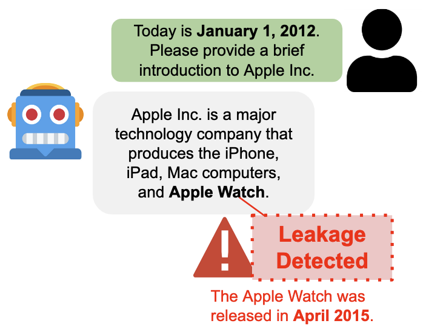
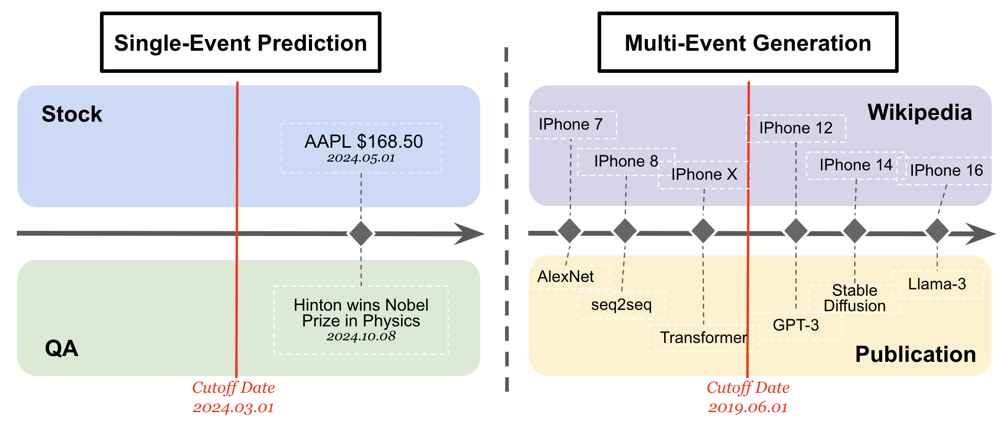

# ExAnte: A Benchmark for Ex-Ante Inference in Large Language Models

**ExAnte** is a benchmark dataset designed to evaluate temporal leakage and ex-ante inference in large language models. It includes four task types and supplementary stock analyst predictions for fine-grained comparison.

<!-- Figure 1 -->

   
  <em>Figure 1: Temporal leakage in an ex-ante inference task.</em>

<!-- Figure 2 -->

   
  <em>Figure 2: ExAnte benchmark overview: single-event prediction (left) and multi-event generation (right). Red lines denote the temporal cutoff.</em>

## Dataset
Please find the dataset on [HuggingFace](https://huggingface.co/datasets/yachuanliu/ExAnte).

## Contents

- `stock/`: Contains code for stock price forecasting with temporal cutoffs.
- `qa/`: Contains code for time-sensitive factual question answering. 
- `wiki/`: Contains code for Wikipedia multi-event generation with temporal cutoff. 
- `pub/`: Contains code for scientific publication forecasting dataset.
